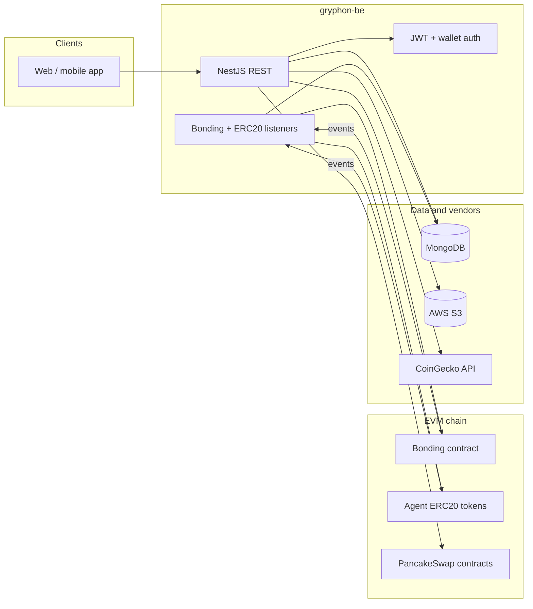

# Gryphon Backend

API and indexing layer for **Gryphon** — a Web3 product where each **agent** is represented by an on-chain token. This service bridges smart contracts, market data, and clients: it ingests bonding-curve lifecycle events, persists agent and trading state in MongoDB, exposes REST endpoints for the app, and integrates DEX pricing (PancakeSwap-style pools) with [CoinGecko](https://www.coingecko.com/) market data.

Built with [NestJS](https://nestjs.com/) and TypeScript, it is structured for clarity (feature modules, shared config, global guards) and for production concerns (structured logging, CORS with credentials, validated configuration patterns).

---

## What this codebase demonstrates

- **NestJS architecture**: modular boundaries (`Auth`, `Agent`, `Blockchain`, `User`, `Coingecko`, `S3`), dependency injection, lifecycle hooks (`OnApplicationBootstrap` for listeners).
- **Web3 / EVM integration**: [ethers v6](https://docs.ethers.org/) JSON-RPC and WebSocket providers, typed contract ABIs, event subscriptions (`Launched`, `Graduated` on the bonding contract; ERC-20 `Transfer` indexing for agent tokens).
- **DeFi-aware domain logic**: bonding-curve metadata before graduation; after graduation, LP-aware stats via router/factory/pair reads aligned with BSC / PancakeSwap-style contracts.
- **Security-minded auth**: wallet-based login with a server-issued nonce and signature verification; JWT delivered as an **httpOnly** cookie (with `Authorization: Bearer` fallback in the JWT strategy).
- **Data layer**: MongoDB ([Mongoose](https://mongoosejs.com/)) schemas for agents, pre-bond state, stats, OHLCV-style graph buckets, and transactions.
- **Cloud & HTTP**: AWS S3 uploads (multer), [Axios](https://axios-http.com/) via `@nestjs/axios` for CoinGecko Pro API, global response envelope and HTTP request logging.

---

## High-level architecture



On **`Launched`**, the bonding handler materializes an `Agent` plus pre-bond metrics and attaches an ERC-20 listener for that token. On **`Graduated`**, the agent is marked graduated, linked to a Pancake LP pair, and downstream reads switch to DEX-oriented stats where applicable.

---

## Tech stack

| Area | Choice |
|------|--------|
| Runtime | Node.js, TypeScript |
| Framework | NestJS 11 |
| Database | MongoDB + Mongoose |
| Blockchain | ethers.js v6 |
| Auth | Passport JWT, wallet signature verification |
| Storage | AWS S3 (image uploads) |
| External APIs | CoinGecko Pro (prices, OHLCV, pool metadata) |
| Logging | Winston (via nest-winston), request middleware |

---

## Main HTTP surface (overview)

| Prefix | Role |
|--------|------|
| `GET /` | Health-style root (public) |
| `/auth` | `GET /auth/nonce`, `POST /auth/wallet-login` (public); JWT in httpOnly cookie |
| `/users` | User and wallet CRUD-style operations |
| `/agents` | List agents, fetch by id or token, token list, OHLCV-style series (many routes public) |
| `/blockchain` | Token info from bonding, swap quote helpers (`get-amounts-out`) |
| `/coingecko` | Proxied / enriched market and pool data (some routes public) |
| `POST /images/upload` | Multipart upload to S3 (public in current code) |

Most routes are protected by a **global JWT guard**; anything intended to be anonymous is explicitly marked with a `@Public()` decorator.

Responses are wrapped by a global interceptor into a consistent shape: `{ success, message, data, meta }`.

---

## Prerequisites

- Node.js (LTS recommended) and npm  
- MongoDB instance  
- EVM RPC + **WebSocket** endpoint (for live event listeners)  
- AWS credentials and S3 bucket (for uploads)  
- Optional: CoinGecko Pro API key for higher rate limits and Pro endpoints  

---

## Configuration

The app loads **`./.env.${NODE_ENV}`** (for example `.env.development` when `NODE_ENV=development`). You can start from the included **`.env example`** file in the repo root: copy it to the appropriate filename and fill in secrets.

Variables consumed by the app include (non-exhaustive; see `src/config/configuration.ts` and services for full usage):

- **Core**: `NODE_ENV`, `PORT`, `DATABASE_URL`  
- **Auth**: `JWT_SECRET`, `JWT_EXPIRATION`, `SIGNATURE_MESSAGE`  
- **Chain**: `RPC_URL`, `WS_URL`, `NETWORK`, and contract addresses (`GRYPHON_ERC20`, `BONDING`, `FRouter`, `FFactory`, `AGENT_FACTORY`, `PANCAKE_ROUTER`, `PANCAKE_FACTORY`, `BUSD`, `GRYPHON_BUSD_POOL`)  
- **AWS**: `AWS_ACCESS_KEY_ID`, `AWS_SECRET_ACCESS_KEY`, `AWS_BUCKET_NAME`, `AWS_REGION`  
- **Logging**: `LOG_LEVEL`, `LOG_OUTPUT`  
- **CoinGecko**: `COINGECKO_API_KEY` (optional but recommended)  

> **Note:** Joi-based startup validation exists in `src/config/config.validation.ts` but is **not** wired in `ConfigModule` by default. Uncomment `validate` there if you want strict fail-fast env checks.

---

## Scripts

```bash
npm install
npm run start:dev      # watch mode, NODE_ENV=development
npm run start:staging  # watch mode, NODE_ENV=staging
npm run start:prod     # production
npm run build
npm run test
npm run test:e2e
npm run test:cov
npm run lint
```

---

## Project layout (abbreviated)

```
src/
  agent/           # Agent domain, stats, graphs, transactions
  auth/            # Wallet login, JWT, guards, public decorator
  blockchain/      # RPC service, bonding + ERC20 listeners/handlers, Pancake + router/pair services
  coingecko/       # Market data integration
  user/            # Users, wallets, social profiles
  s3/              # Image upload to S3
  config/          # Central configuration factory
  logger/          # Winston + HTTP logging middleware
  interceptors/    # Uniform API response envelope
  database/        # Mongo connection module
```

Contract ABIs live under `src/blockchain/contracts/abi/`.

---

## Author

Umang Ajmera
LinkedId: https://www.linkedin.com/in/umang-ajmera/
